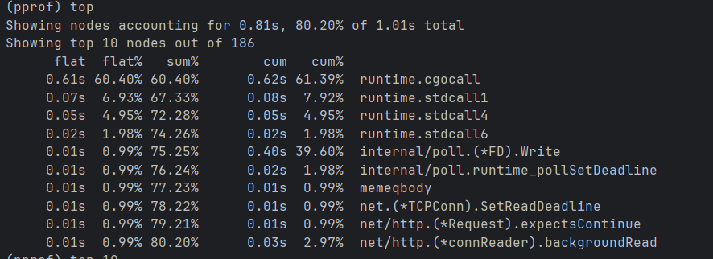
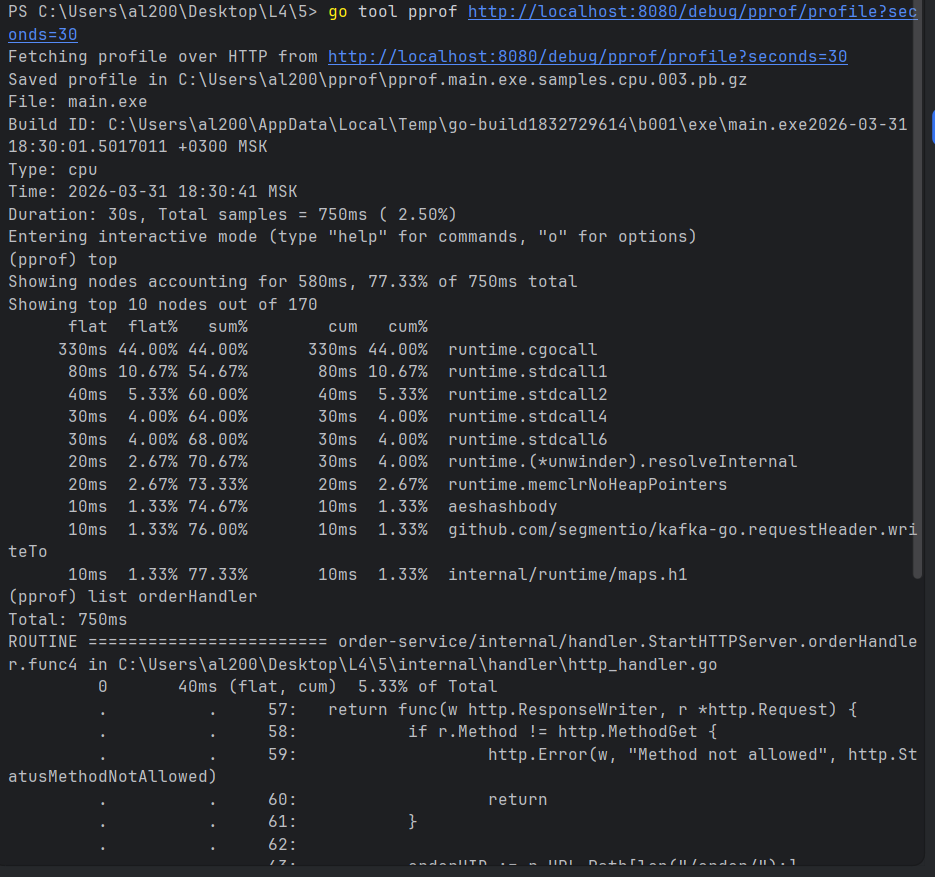
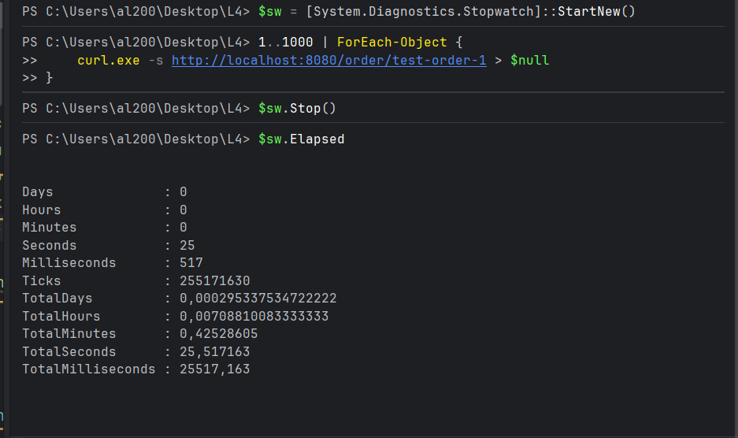

# wbstechno — профилирование и оптимизация HTTP API на Go

## Описание

Проект исследует производительность HTTP endpoint-а `GET /order/{id}` в сервисе заказов на Go.

Сценарий работы сервиса:

- заказ поступает через Kafka
- проходит обработку и валидацию
- сохраняется в PostgreSQL
- кладётся в in-memory cache
- по HTTP запрашивается по `order_uid`

Цель работы — создать нагрузку на API, снять профили, сделать benchmark-и и проверить оптимизации по CPU и памяти.

---

## Что исследовалось

В качестве основного сценария был выбран endpoint:

```http
GET /order/{id}
```

Почему именно он:

- это основной read-path сервиса
- он удобен для многократной нагрузки
- в нём есть цепочка `handler -> service -> cache -> response`
- он хорошо подходит для анализа `pprof`, `go test -bench`, `benchstat`, `trace`

---

## Подготовка стенда

### 1. Поднятие инфраструктуры

Используется `docker-compose` с:

- PostgreSQL
- Zookeeper
- Kafka
- Kafka UI

Запуск:

```bash
docker compose down -v
docker compose up -d
```

### 2. Конфигурация БД

Актуальные параметры `.env`:

```env
DB_HOST=localhost
DB_PORT=5433
DB_USER=admin
DB_PASSWORD=admin
DB_NAME=wbtech
DB_SSLMODE=disable

KAFKA_BROKERS=localhost:9092
KAFKA_TOPIC=orders
KAFKA_GROUP_ID=order-service-group

HTTP_PORT=:8080

CACHE_MAX_SIZE=100
CACHE_RESTORE_LIMIT=100
CACHE_TTL=60m
```

## Загрузка тестовых данных

Тестовый заказ загружался через Kafka, чтобы сохранить реальный ingestion path проекта.

Вход в Kafka-контейнер:

```bash
docker exec -it kafka sh
```

Отправка сообщения:

```bash
kafka-console-producer --broker-list kafka:9092 --topic orders
```

Далее в producer отправлялся JSON заказа одной строкой.

Пример тестового сообщения:

```json
{"order_uid":"test-order-1","track_number":"TRACK12345","entry":"WBIL","delivery":{"name":"Ivan","phone":"+79001234567","zip":"123456","city":"Moscow","address":"Lenina 10","region":"MoscowRegion","email":"ivan@example.com"},"payment":{"transaction":"550e8400-e29b-41d4-a716-446655440000","request_id":"","currency":"RUB","provider":"wb","amount":1500,"payment_dt":1710000000,"bank":"alpha","delivery_cost":300,"goods_total":1200,"custom_fee":0},"items":[{"chrt_id":12345,"track_number":"TRACK12345","price":1200,"rid":"RID12345","name":"Shirt","sale":0,"size":"M","total_price":1200,"nm_id":111,"brand":"Nike","status":202}],"locale":"ru","internal_signature":"","customer_id":"customer-1","delivery_service":"meest","shardkey":"9","sm_id":99,"date_created":"2024-03-10T12:00:00Z","oof_shard":"1"}
```

После успешной обработки в логах появлялось подтверждение сохранения заказа в БД и кэш.

Проверка endpoint-а:

```bash
curl http://localhost:8080/order/test-order-1
```

---

## Подключение pprof

В проект был подключён `net/http/pprof`.

Проверка:

```text
http://localhost:8080/debug/pprof/
```

Снятие CPU profile:

```bash
go tool pprof http://localhost:8080/debug/pprof/profile?seconds=30
```

Во время съёма профиля endpoint нагружался запросами на `/order/test-order-1`.

### Наблюдения по CPU profile

Первичный CPU profile показал, что заметная часть времени уходит в системные вызовы и сетевой/HTTP overhead:



- `runtime.cgocall`
- `internal/poll.(*FD).Write`

Это означало, что end-to-end профиль живого HTTP запроса включает значительный I/O overhead и не позволяет сразу локализовать оптимизацию только по бизнес-логике.

После отключения лишнего `fmt.Printf` в hot path влияние логирования уменьшилось, но основная картина не изменилась: узкое место было не в самом `GetOrder`, а выше по стеку.

---

## Ручной baseline HTTP

Для грубого внешнего baseline использовалась серия HTTP-запросов через `curl`.

Пример замера в PowerShell:

```powershell
$times = @()
1..100 | ForEach-Object {
    $sw = [System.Diagnostics.Stopwatch]::StartNew()
    curl.exe -s http://localhost:8080/order/test-order-1 > $null
    $sw.Stop()
    $times += $sw.Elapsed.TotalMilliseconds
}
$times | Measure-Object -Average -Minimum -Maximum
```

Пример наблюдений:


- среднее время ответа было около **25 ms**
- endpoint работал корректно
- запрос шёл по cache-hit path

Этот замер использовался только как внешний baseline. Для точного анализа дальше использовались benchmark-и.

---

## Benchmark-и

### 1. Service-level cache hit

Первый benchmark был сделан на уровне service-layer для сценария cache hit:

```text
BenchmarkGetOrderCacheHit-16    5775766    217.5 ns/op    0 B/op    0 allocs/op
```

### Вывод

Получение заказа из кэша на уровне `GetOrder`:

- очень быстрое
- не создаёт аллокаций
- само по себе не является bottleneck

Это позволило исключить `service.GetOrder` как основную причину медленного HTTP endpoint-а.

---

### 2. Handler benchmark

Далее был сделан benchmark успешного HTTP handler path через `httptest`:

```text
BenchmarkOrderHandler-16    106702    10554 ns/op    7492 B/op    20 allocs/op
```

### Вывод

По сравнению с service-level benchmark стало видно, что основная стоимость сидит в:

- HTTP handler слое
- формировании ответа
- JSON serialization
- работе с `ResponseWriter`

---

### 3. JSON serialization benchmark

Для отделения JSON-стоимости от самого handler был добавлен benchmark сериализации полного `database.Order`:

```text
BenchmarkJsonEncodeOrder-16    248634    4572 ns/op    993 B/op    3 allocs/op
```

### Вывод

JSON serialization сама по себе вносит заметную долю стоимости успешного запроса.

---

## Оптимизация: response DTO для success path

### Мотивация

Фронтенд использует не все поля `database.Order`.

По UI реально нужны:

- `order_uid`
- `track_number`
- `date_created`
- данные доставки
- часть данных оплаты
- часть данных по товарам

Не используются многие служебные и внутренние поля доменной модели:

- `entry`
- `locale`
- `internal_signature`
- `customer_id`
- `delivery_service`
- `shardkey`
- `sm_id`
- `oof_shard`
- часть полей `payment`
- часть полей `items`

### Что было сделано

Вместо прямой сериализации `database.Order`:

```go
json.NewEncoder(w).Encode(order)
```

была введена отдельная response DTO-модель в `internal/handler/response_models.go`:

- `OrderResponse`
- `DeliveryResponse`
- `PaymentResponse`
- `ItemResponse`

И отдельное преобразование:

```go
toOrderResponse(order)
```

### Идея

Разделить:

- внутреннюю доменную модель
- внешний HTTP response

и сериализовать только реально используемые фронтендом поля.

---

## Результаты после DTO

### Handler benchmark после оптимизации

```text
BenchmarkOrderHandler-16    137530    9466 ns/op    7105 B/op    22 allocs/op
```

### JSON benchmark для DTO

```text
BenchmarkJsonEncodeOrderResponse-16    352225    3054 ns/op    608 B/op    3 allocs/op
```

---

## Сравнение через benchstat

Для сравнения старой и новой версии handler использовался `benchstat`.

### Важная особенность Windows / PowerShell

`benchstat` не читает файлы benchmark-результатов, если они были сохранены через обычный PowerShell redirection `>` в UTF-16.

Правильный способ сохранения в UTF-8:

```powershell
go test ./internal/handler -run=^$ -bench=BenchmarkOrderHandler -benchmem -count=10 | Set-Content -Encoding utf8 old_handler.txt
go test ./internal/handler -run=^$ -bench=BenchmarkOrderHandler -benchmem -count=10 | Set-Content -Encoding utf8 new_handler.txt
```

Установка `benchstat`:

```bash
go install golang.org/x/perf/cmd/benchstat@latest
```

Запуск:

```bash
benchstat.exe .\old_handler.txt .\new_handler.txt
```

### Результат `benchstat`

```text
goarch: amd64
pkg: order-service/internal/handler
cpu: AMD Ryzen 7 5700U with Radeon Graphics

                │ .\old_handler.txt │       .\new_handler.txt       │
                │      sec/op       │   sec/op     vs base          │
OrderHandler-16        8.820µ ± 28%   8.943µ ± 7%  ~ (p=0.436 n=10)

                │ .\old_handler.txt │          .\new_handler.txt          │
                │       B/op        │     B/op      vs base               │
OrderHandler-16        7.317Ki ± 0%   6.939Ki ± 0%  -5.16% (p=0.000 n=10)

                │ .\old_handler.txt │         .\new_handler.txt          │
                │     allocs/op     │ allocs/op   vs base                │
OrderHandler-16          20.00 ± 0%   22.00 ± 0%  +10.00% (p=0.000 n=10)
```

### Интерпретация

DTO-оптимизация:

- **не дала статистически значимого выигрыша по времени**
- **уменьшила объём памяти на операцию примерно на 5.16%**
- **увеличила число аллокаций** из-за дополнительного преобразования `database.Order -> OrderResponse`

### Dывод


- response стал компактнее
- сериализация DTO дешевле
- handler стал экономнее по памяти
- но число аллокаций выросло из-за mapping-а

---

## Trace

Для анализа поведения программы во времени использовался `go tool trace`.

Снятие trace:

```bash
curl.exe "http://localhost:8080/debug/pprof/trace?seconds=5" -o trace.out
```

Открытие:

```bash
go tool trace trace.out
```

Trace снимался во время нагрузки на endpoint `/order/test-order-1`.

### Наблюдения по trace

В trace было видно:

- основная активность под нагрузкой сосредоточена в goroutine HTTP-сервера:
  - `net/http.(*conn).serve`
  - `net/http.(*connReader).backgroundRead`
- Kafka consumer присутствует в фоне, но в основном проводит время в `syscall`, то есть ждёт сетевой I/O
- явного крупного bottleneck-а в user-space логике trace не показал

### Вывод по trace

Это согласуется с benchmark-ами:

- `GetOrder` cache hit сам по себе очень дешёвый
- основная стоимость сценария находится в HTTP/JSON слое
- Kafka consumer не является основным источником CPU-нагрузки в исследуемом read-path сценарии

---
